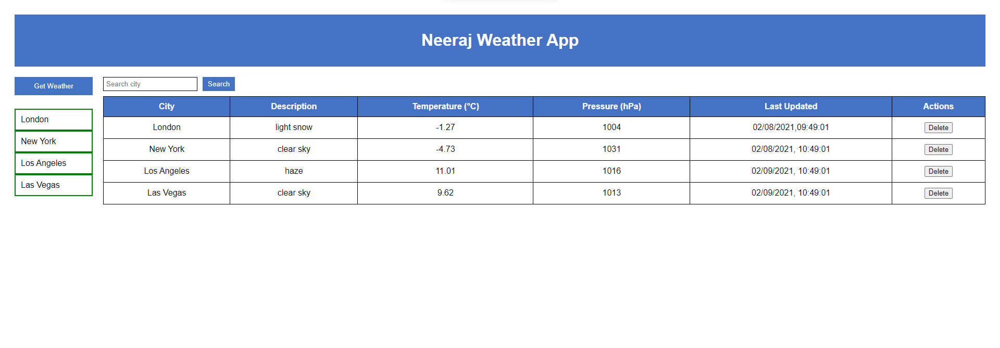

# Weather App

A simple weather application that allows users to view weather details for various cities. The app fetches weather data from a public API and provides functionalities like searching for a city, editing weather descriptions, and deleting weather records.

## Features

- **City List**: View and select from a list of predefined cities.
- **Weather Details**: Display current weather information, including temperature, pressure, and a description of the weather.
- **Search Functionality**: Search for a city and highlight its weather details if they exist or fetch new data if not.
- **Editable Descriptions**: Edit the weather descriptions directly in the table.


## Technologies Used

- **React**: JavaScript library for building user interfaces.
- **CSS**: Styling the application for a better user experience.
- **Fetch API**: Used to make HTTP requests to retrieve weather data.

## Installation

To run this project locally, follow these steps:

1. **Clone the repository**:
   ```bash
   git clone https://github.com/nsb199/weather-app.git
 ```
 
 2. **Navigate into the project directory**:
 ```bash
 cd weather-app
```

3. **Install Dependencies**:
```bash
npm install
```

4. **Start the Application**:
```bash
npm start
```

 The application should now be running at http://localhost:3000

## Usage

1. Click the Get Weather button to fetch weather details for the predefined cities.
2. Select a city from the list to view its weather details.
3. Use the search bar to find a city, highlighting it if it exists.
4. Edit the weather description directly in the table.
5. Click the Delete button to remove a city's weather data.

## Screenshot



## License

This project is licensed under the MIT License.